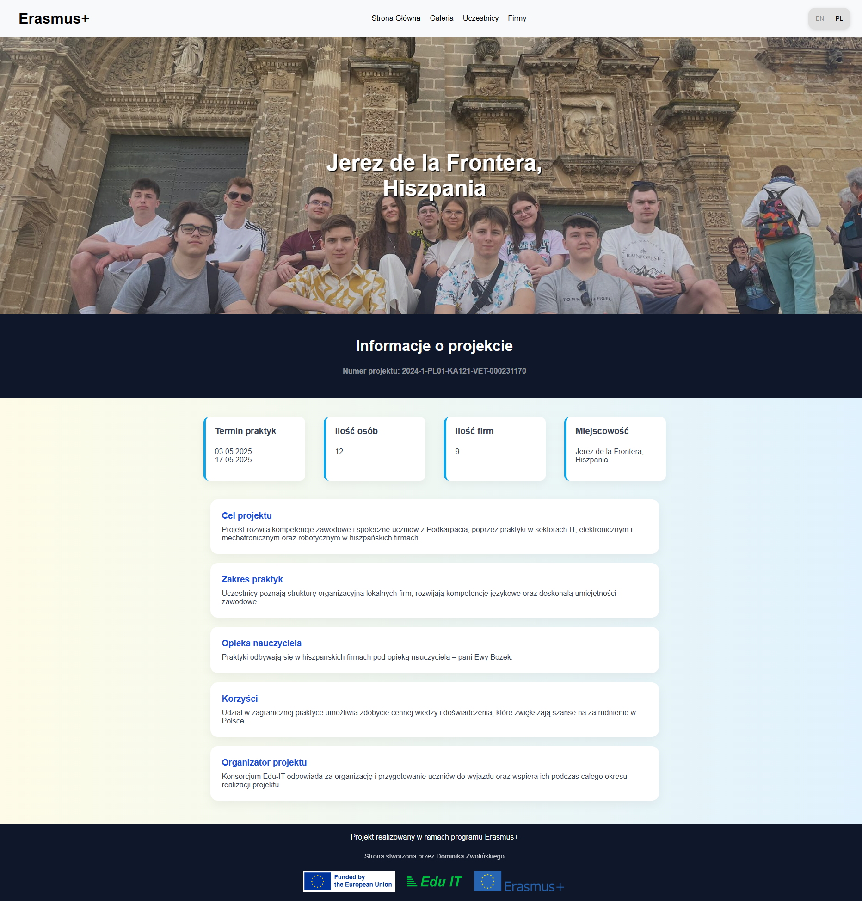
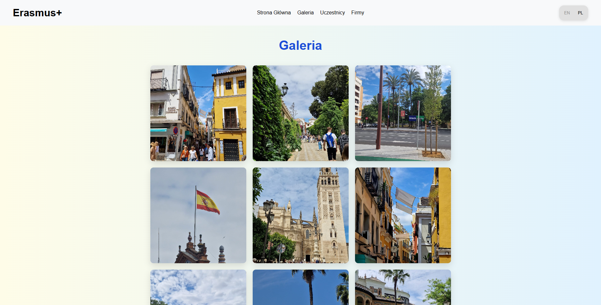
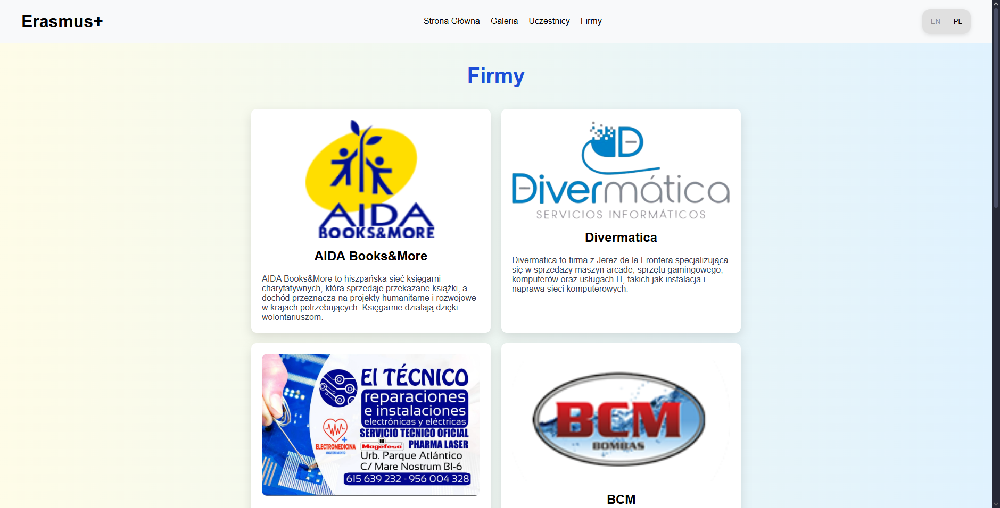
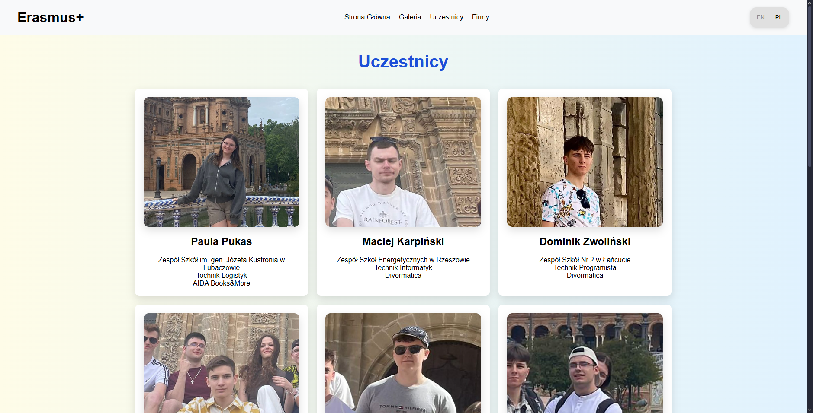

# Strona Erasmus – Konsorcjum Edu-IT

Strona internetowa przygotowana w ramach programu **Erasmus+** w Hiszpanii, koordynowanego przez **konsorcjum Edu-IT**. Projekt ma na celu zaprezentowanie szczegółów mobilności, uczestników oraz firm przyjmujących w ramach projektu
📄 **2024-1-PL01-KA121-VET-000231170**

## 🧩 Funkcjonalności

- Prezentacja ogólnych informacji o mobilności Erasmus+
- Lista uczestników oraz firm partnerskich
- Galeria zdjęć z wyjazdu
- Responsywny design dopasowany do urządzeń mobilnych
- Obsługa języków (EN / PL)

## 🛠️ Technologie

- HTML5
- CSS3
- JavaScript (Vanilla)

## 🖼️ Zrzuty ekranu

### 🏠 Strona główna



### 🖼️ Galeria



### 👨‍💼 Sekcja firm partnerskich



### 👩‍🎓 Sekcja uczestników



## 🚀 Uruchomienie lokalne

1. Sklonuj repozytorium:

   ```bash
   git clone https://github.com/Domun335/erasmus.git
   cd erasmus
   ```

2. Otwórz plik `index.html` w przeglądarce (dwuklik lub przeciągnij do przeglądarki).

Brak zależności – projekt działa w 100% lokalnie bez dodatkowych instalacji.
